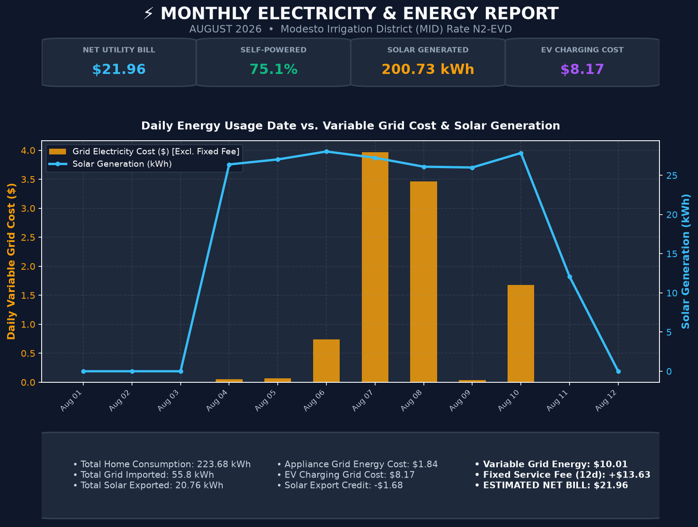

# Smart EV Charger Automation ⚡☀️

An intelligent, model-agnostic Python daemon that automatically charges your Electric Vehicle using free solar power and Tesla Powerwall battery reserves, avoiding expensive peak utility rates.

Designed to maximize free solar energy consumption, isolate EV charging costs from general household loads, provide AI-driven bill reduction advice, and dynamically calculate electric bills matching your utility provider's precise rate structure (MID Rate N2-EVD, PG&E EV2-A, or Custom).

---

## 🌟 Key Features

- ☀️ **Solar & Powerwall Synchronization**: Syncs with **NetZero API** to monitor Tesla Powerwall battery levels and solar generation. Automatically starts EV charging when house battery exceeds thresholds (e.g., `> 40%`) and stops when battery drops (e.g., `< 25%`).
- ⚡ **ChargePoint Flex Control**: Asynchronously controls ChargePoint Home Flex chargers, adjusting amperage (8A–32A) and tracking delivered energy (`kWh`), charging power (`kW`), and range added (`miles`).
- 🛡️ **Guarded Manual / Boost Mode**: Force start charging with full power (32A) or custom amperage with smart guardrails (e.g. *"Charge at 32A until 16:00 or stop if battery drops below 30%"*). Automatically stops and restores solar automation when guard limits are met.
- 📊 **Automated Monthly PNG Bill & Usage Report**: Generates a high-resolution infographic report on the **1st of every month at 07:00 AM** (or on-demand via Telegram for any past month).
  - **Daily Usage vs. Cost Graph**: Plots daily dates against **Variable Grid Energy Cost ($)** (excluding fixed daily connection fees) and **Solar Generation (kWh)**.
  - **Exact Utility Cost Breakdown**: Shows Net Bill ($), Solar Self-Powered %, EV Charging Cost ($), Appliance Energy Cost ($), Solar Export Credits (-$), and Fixed Monthly Connection Fees (+$).
- 🧠 **7:00 AM Morning AI Briefing**: Every morning at 07:00 AM, posts a Telegram energy briefing with yesterday's bill breakdown and personalized appliance scheduling advice.
- 🤖 **Model-Agnostic AI Telegram Assistant**: Natural-language conversational interface powered by your choice of AI model (**NVIDIA Nemotron**, **OpenAI**, **Claude**, or **Gemini**) to query status, update thresholds, or control charging.
- 💰 **EV vs. Home Cost Isolation**: Intelligently separates EV charger grid energy draw from heavy home appliances (AC, laundry, kitchen) for precise cost tracking.
- 🛡️ **Safety & Night Blackouts**: Customizable weekday night blackout window (4 PM – 9 AM) and emergency shutoffs during Powerwall off-grid or Storm Watch events.

---

## 📊 Sample Monthly Utility & Energy Bill Report

The system delivers a high-resolution 188 KB PNG infographic card directly to your Telegram chat:



---

## 🚀 Quick Setup & Deployment

### 1. Local Setup
```bash
git clone https://github.com/suhasm1990/smart_ev_charger.git
cd smart_ev_charger
python3 -m venv .venv && source .venv/bin/activate
pip install -r requirements.txt
cp .env.example .env
python main.py
```

### 2. Docker Deployment
```bash
docker-compose up -d
```

---

## 🤖 Telegram AI Assistant & Commands

| User Prompt / Command | Description |
| :--- | :--- |
| `/daily_agent`, `/plan` or *"Run daily agent"* | Manually triggers the Daily AI Agent to optimize thresholds and send the morning energy strategy briefing. |
| `/monthly_report` or *"Generate report for July"* | Generates & sends the PNG utility bill report for any past month. |
| *"Charge with full power now, but stop if battery is below 30%"* | Starts 32A charging with an active 30% battery stop guardrail. |
| *"Charge at 32A until 16:00"* | Forces 32A charging with an auto-stop cutoff at 4:00 PM (16:00). |
| *"Charge for 2 hours at full power"* | Runs manual charging for 2 hours, then auto-stops and resumes auto mode. |
| *"What's today's usage?"* | Computes total home consumption, solar generated, EV charging share, and current bill. |
| *"How much did EV charging cost this week?"* | Calculates EV grid energy cost vs. general home appliances. |
| *"Set battery start to 50% and stop at 30%"* | Dynamically updates Powerwall battery start/stop thresholds. |
| *"Why did charging stop last time?"* | Queries recent session log history and stop reasons. |

---

## 📁 Repository Structure

```
smart_ev_charger/
├── Dockerfile                   # Production Docker image build
├── docker-compose.yml           # Compose service definition
├── .dockerignore                # Excludes tests, .venv, archives from container build
├── requirements.txt             # Project dependencies
├── README.md                    # Documentation & architecture guide
├── .env.example                 # Environment variables template
│
├── main.py                      # Main entry point (scheduler & daemon loop)
│
├── core/                        # Core configuration, state, and decision models
│   ├── config.py                # Environment & dynamic configuration schema
│   ├── state.py                 # In-memory runtime state & guardrails
│   ├── decision.py              # State-machine rules (solar, battery, blackout)
│   ├── manual_override.py      # Manual override & auto-reset manager
│   └── tou.py                   # Time-Of-Use rate schedule calculations
│
├── services/                    # Hardware & Cloud API Integrations
│   ├── chargepoint.py           # ChargePoint Home Flex API wrapper
│   ├── netzero.py               # Tesla Powerwall NetZero API client
│   └── sheets_db.py             # Google Sheets cloud database sync
│
├── agent/                       # Autonomous AI Intelligence & Telegram Bot
│   ├── telegram_bot.py          # Telegram Bot interface & tool executor
│   ├── llm_client.py            # Model-agnostic LLM adapter (NVIDIA, OpenAI, Claude, Gemini)
│   ├── daily_agent.py           # 7:00 AM autonomous morning briefing
│   └── alerts.py                # Dynamic condition & threshold alerts
│
├── reporting/                   # Telemetry, Reports & Notifications
│   ├── logger.py                # System rotating file & console loggers
│   ├── csv_logger.py            # CSV telemetry logger & analytics engine
│   ├── notifications.py         # Push / Telegram notifier
│   └── report_generator.py      # High-resolution PNG monthly bill graphic generator
│
├── tests/                       # Unit & Integration Tests (isolated from production)
│   ├── test_chargepoint.py
│   ├── test_guarded_manual.py
│   └── test_tz.py
│
├── docs/                        # Screenshots & documentation assets
└── logs/                        # Runtime CSV & text logs
```
